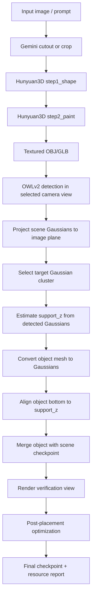
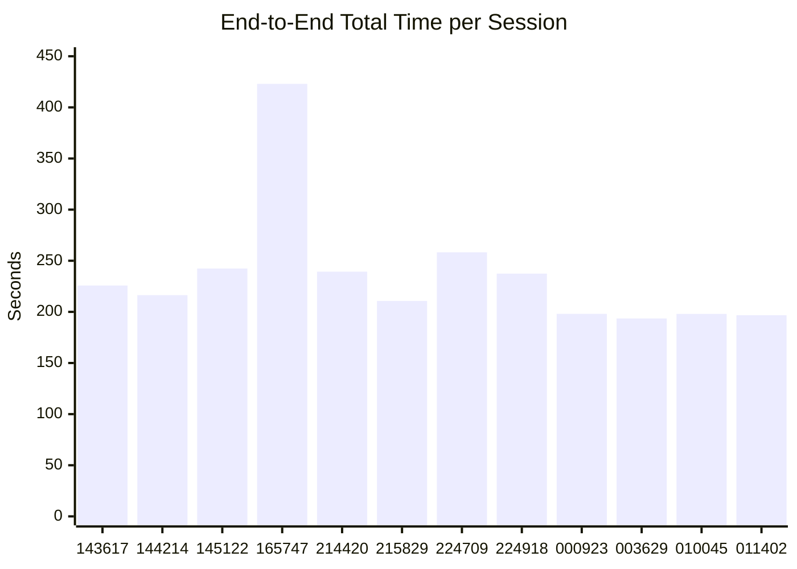

# DG-3DPlace Architecture

This document describes the full placement pipeline used in this repository, with emphasis on:

- how the system turns a 2D prompt/image into a 3D object,
- how the object is initially placed on a support surface without sinking or floating,
- how the refinement loss works,
- and what the session timing reports show end to end.

The code paths below are the main anchors:

- [placement_4/2d_3d.py](placement_4/2d_3d.py)
- [placement_4/detection_optimized.py](placement_4/detection_optimized.py)
- [placement_4/glb_to_gaussians.py](placement_4/glb_to_gaussians.py)
- [DG_3DPlace_Optimization/src/utils/loss_utils.py](DG_3DPlace_Optimization/src/utils/loss_utils.py)
- [DG_3DPlace_Optimization/src/refiner/optimizer.py](DG_3DPlace_Optimization/src/refiner/optimizer.py)
- [DG_3DPlace_Optimization/run_refinement.py](DG_3DPlace_Optimization/run_refinement.py)

## System Overview

The pipeline is a two-stage system:

1. Generate or recover a textured 3D object mesh from a prompt/image.
2. Place the object into a Gaussian-splat scene, then refine pose and appearance using a differentiable renderer and a composite loss.

The key architectural idea is to separate:

- semantic detection of where the object should go,
- geometric conversion of the object into Gaussians,
- support-surface alignment,
- and final optimization.

That separation matters because it makes the object placement deterministic before optimization, which reduces the chance of the object being centered through a table or floor.



## End-to-End Pipeline

### 1) 2D input to textured 3D object

The object branch is implemented in [placement_4/2d_3d.py](placement_4/2d_3d.py). It can either:

- create a Gemini cutout first, then run Hunyuan3D,
- or skip Gemini and reuse a saved cutout for debugging.

The main flow is:

```python
print(f"Running Hunyuan3D step1 (shape generation)...")
ok, msg = _run_step1_shape_subprocess(
    input_image_path=shape_input_image,
    output_mesh_path=output_obj_path,
    conda_env=conda_env,
)

print(f"Running Hunyuan3D step2 (texture painting)...")
ok, msg = _run_step2_paint_subprocess(
    mesh_path=output_obj_path,
    image_path=shape_input_image,
    output_folder=output_dir,
    conda_env=conda_env,
)
```

Why this exists:

- Step 1 gives the object geometry.
- Step 2 provides color/texture so the inserted object matches the visual evidence in the source image.
- The output can be either OBJ or GLB, but the placement stage prefers the textured GLB when available for color fidelity.

### 2) Camera selection and scene grounding

The detection pipeline begins by loading the scene checkpoint, rendering several orbit views, and letting the user select a camera. That is the anchor view for semantic detection and 3D projection.

In [placement_4/detection_optimized.py](placement_4/detection_optimized.py), the scene camera is defined with a consistent OpenGL/OpenCV conversion so projection and rendering stay in the same coordinate convention.

Why this matters:

- A stable camera convention prevents sign errors in projection.
- The selected camera state is saved to disk so the final render and the optimization step can reuse the exact same view.

### 3) Object detection and mask cleanup

The object is first detected in the selected camera view with OWLv2. The code uses simplified query variants to improve robustness when the full prompt is noisy.

The detection stage also builds an object mask from the Gemini edit when available. The mask is cleaned with connected-component filtering so the downstream 3D selection is not polluted by small fragments.

The important idea is that the pipeline does not directly trust a single raw detector output. It combines:

- prompt-guided detection,
- mask differencing,
- and connected-component selection.

This reduces false positives and makes the 3D target cluster more stable.

### 4) Projection of scene Gaussians into the view

The selected camera is used to project every scene Gaussian into the image plane. Gaussians are filtered by:

- image bounding box containment,
- valid depth,
- and opacity threshold.

The effect is that the 2D detection box becomes a 3D object region in the checkpoint.

### 5) Initial placement with support-surface alignment

This is the main novelty relevant to the sinking/floating issue.

Earlier centroid-based placement would center the object at the detected Gaussian cluster. That tends to push half of the object below the support plane when the support is a tabletop or floor.

The current pipeline fixes that by estimating a support height from the detected cluster and aligning the bottom of the generated object to that height.

The relevant logic in [placement_4/detection_optimized.py](placement_4/detection_optimized.py) is:

```python
target_means = means[object_indices]
target_min = target_means.min(axis=0)
target_max = target_means.max(axis=0)
target_center = target_means.mean(axis=0)
target_extent = target_max - target_min

scale = min(target_extent[0], target_extent[1])

try:
    support_z = float(np.percentile(target_means[:, 2], 20))
except Exception:
    support_z = float(target_center[2])

translation = np.array([float(target_center[0]), float(target_center[1]), 0.0], dtype=np.float32)
```

The object conversion then receives `support_z`:

```python
object_gaussians = glb_to_gaussians(
    glb_path=mesh_for_color,
    num_gaussians=num_gaussians,
    target_scale=float(scale),
    scale_factor=0.4,
    rotation=None,
    translation=translation,
    support_z=support_z,
    opacity_logit=5.0,
    run_render_colmap=True,
    work_dir=os.path.join(SESSION_DIR, "glb_colmap_gs"),
    conversion_mode="train",
    trainer_cmd_template=trainer_cmd_template,
)
```

Why this works:

- `target_center.x` and `target_center.y` still place the object over the detected region.
- `support_z` decides the vertical contact plane.
- The object bottom is aligned to the support surface instead of the object center being placed there.

This is the main fix for the sink/floating artifact.

### 6) Support-aware Gaussian conversion

The support alignment is applied inside [placement_4/glb_to_gaussians.py](placement_4/glb_to_gaussians.py) so the same rule works in both train mode and sample mode.

```python
if translation is not None:
    means += np.asarray(translation, dtype=np.float32)

if support_z is not None and means.size > 0:
    min_z = float(means[:, 2].min())
    shift = float(support_z - min_z)
    means[:, 2] += shift
```

This is intentionally applied after the object is centered, scaled, rotated, and translated, so the vertical correction is the last geometric step.

Why we do it here instead of only in the caller:

- The train-mode branch and the sample-mode branch both need the same behavior.
- Placing the correction in the shared conversion function keeps the object bottom alignment consistent regardless of how the object Gaussians are produced.

### 7) Merge with the scene checkpoint

After conversion, the object Gaussians are concatenated with the scene Gaussians and stored as a new checkpoint. That gives the system a single representation for rendering, evaluation, and refinement.

This merged checkpoint also stores metadata such as `num_object_gaussians`, which lets the optimizer recover the object/background split later.

### 8) Post-placement optimization

The placement stage is followed by a differentiable optimization pass in [DG_3DPlace_Optimization/run_refinement.py](DG_3DPlace_Optimization/run_refinement.py). This stage improves pose and alignment using differentiable rasterization.

The pose optimizer is defined in [DG_3DPlace_Optimization/src/refiner/optimizer.py](DG_3DPlace_Optimization/src/refiner/optimizer.py):

```python
class PoseOptimizer(nn.Module):
    def __init__(self, device="cuda"):
        super().__init__()
        self.translation = nn.Parameter(torch.zeros(3, dtype=torch.float32, device=device))
        self.rotation = nn.Parameter(torch.tensor([1.0, 0.0, 0.0, 0.0], dtype=torch.float32, device=device))
        self.scale_scalar = nn.Parameter(torch.tensor(1.0, dtype=torch.float32, device=device))

    def transform_object(self, obj_gaussians):
        centered_means = obj_gaussians['means'] - self.obj_center
        s = torch.abs(self.scale_scalar) + 1e-8
        scaled_rotated_means = torch.matmul(centered_means, (R * s).T)
        transformed_obj['means'] = scaled_rotated_means + self.translation
```

The optimizer is deliberately small:

- one translation parameter,
- one quaternion rotation parameter,
- one uniform scale parameter.

That makes the search space much easier to optimize than a fully free deformable model.

## Loss Functions

There are two different losses in the system, and they serve different purposes.

### A) Gaussian training loss for object synthesis

The native trainer in [placement_4/train_object_gs_native.py](placement_4/train_object_gs_native.py) uses a simple reconstruction loss on rendered views, plus a mild scale regularizer:

```python
loss_l1 = torch.mean(torch.abs(pred - target))
loss_scale_reg = 1e-4 * torch.mean(torch.relu(scales + 7.0) ** 2)
loss = loss_l1 + loss_scale_reg
```

Why this choice works:

- `L1` is stable for image reconstruction and keeps the generated object close to the training views.
- The scale regularizer prevents Gaussian splats from expanding uncontrollably.
- The trainer is intentionally simple because the object synthesis stage is not the final pose solver; it only needs a good textured object representation.

### B) Refinement loss for final placement

The `RefinementLoss` class in [DG_3DPlace_Optimization/src/utils/loss_utils.py](DG_3DPlace_Optimization/src/utils/loss_utils.py) is more expressive:

```python
loss_rgb = self.l1_loss(masked_rendered, masked_target)
loss_lpips = self.lpips_fn(rendered_lpips, target_lpips).squeeze()
loss_mask = F.binary_cross_entropy(rendered_mask, target_mask)
loss_com = ((rend_x - targ_x)**2 + (rend_y - targ_y)**2) / (H * W)

total_loss = (w_rgb * loss_rgb) + (w_lpips * loss_lpips) + (w_mask * loss_mask) + (5.0 * loss_com)
```

The design here is important:

- `L1` on the masked RGB region keeps the visible object appearance consistent.
- LPIPS adds perceptual guidance so the solution is not just pixel-level matching.
- BCE on the mask stabilizes silhouette alignment.
- The center-of-mass term gives a global gradient, which helps when the object starts far from the target.

Why the center-of-mass term matters:

- Mask losses can become weak when there is little overlap.
- CoM provides a coarse pull toward the target even when the object is badly placed.
- That makes the optimization less brittle in the early iterations.

## Design Considerations and Novelties

The main architectural choices are not accidental. They address the practical failure modes of Gaussian object insertion.

### 1) Support-aware initialization instead of centroid anchoring

This is the most important change.

- Centroid anchoring places the object center at the detected cluster center.
- Support-aware anchoring uses a low-percentile support height and aligns the object bottom to it.

That is why the object touches the table/floor instead of intersecting it.

### 2) Shared support correction in `glb_to_gaussians`

Applying the vertical correction in the shared conversion utility keeps train mode and sample mode consistent.

### 3) Separate generation and refinement

The object is first generated as a plausible textured asset, then refined as part of the scene.

This avoids mixing mesh synthesis errors with pose optimization errors.

### 4) CoM-driven refinement

The extra center-of-mass term in the loss is a practical novelty for hard cases where the mask overlap starts near zero.

### 5) Deterministic session artifacts

Each run writes the same set of artifacts into a session folder:

- selected camera state,
- highlighted checkpoint,
- integrated checkpoint,
- final render,
- optimized final render,
- and the resource report.

That makes the pipeline reproducible and easy to compare across runs.

## Timing Analysis From Session Reports

The session reports live in `placement_4/session_*/detection_resource_report.txt`.

I found 12 successful reports in this workspace. The data below is computed directly from those files.

### Summary Statistics

| Metric | Value |
|---|---:|
| Number of successful sessions | 12 |
| Total time, mean | 236.63 s |
| Total time, median | 221.07 s |
| Total time, min | 193.57 s |
| Total time, max | 422.96 s |
| CPU user time, mean | 6.83 s |
| CPU system time, mean | 1.46 s |
| Memory usage, mean | 1379.44 MB |
| GPU memory used, mean | 600.73 MB |

### Typical Stage Durations

These are the per-stage medians across the 12 successful sessions.

| Stage | Median time (s) | Mean time (s) |
|---|---:|---:|
| OWLv2 detection | 4.65 | 4.64 |
| Unprojection & 3D detection | 0.05 | 0.04 |
| Highlighting & ckpt | 0.59 | 0.52 |
| Vase integration | 1.13 | 16.07 |
| Final render | 0.47 | 0.41 |
| Post-placement optimization | 32.12 | 32.94 |
| Optimized final render | 0.46 | 0.40 |

The large difference between the mean and median for `Vase integration` comes from one slow run:

- `session_20260422_165747` took 183.08 s in the integration step and 422.96 s total.

That run is an outlier, so the median is the better description of the typical placement cost.

### Per-Session Timing Table

| Session | OWLv2 det. | Unproj. | Highlight | Integration | Final render | Post-opt | Opt render | Total |
|---|---:|---:|---:|---:|---:|---:|---:|---:|
| 20260422_143617 | 4.72 | 0.05 | 0.60 | 1.54 | 0.50 | 43.73 | 0.49 | 225.77 |
| 20260422_144214 | 4.97 | 0.05 | 0.61 | 1.13 | 0.48 | 31.43 | 0.46 | 216.37 |
| 20260422_145122 | 4.46 | 0.05 | 0.61 | 0.78 | 0.46 | 33.47 | 0.47 | 242.42 |
| 20260422_165747 | 4.39 | 0.05 | 0.59 | 183.08 | 0.50 | 33.37 | 0.49 | 422.96 |
| 20260427_214420 | 4.94 | 0.05 | 0.60 | 1.17 | 0.47 | 32.46 | 0.46 | 239.33 |
| 20260427_215829 | 4.66 | 0.05 | 0.63 | 1.14 | 0.48 | 31.71 | 0.46 | 210.69 |
| 20260427_224709 | 4.35 | 0.05 | 0.71 | 1.19 | 0.47 | 32.88 | 0.45 | 258.25 |
| 20260427_224918 | 4.64 | 0.05 | 0.57 | 1.16 | 0.48 | 32.49 | 0.48 | 237.42 |
| 20260428_000923 | 4.63 | 0.01 | 0.35 | 0.47 | 0.27 | 31.21 | 0.28 | 198.06 |
| 20260428_003629 | 4.84 | 0.01 | 0.38 | 0.47 | 0.27 | 30.10 | 0.28 | 193.57 |
| 20260428_010045 | 4.40 | 0.01 | 0.32 | 0.34 | 0.26 | 30.63 | 0.26 | 198.02 |
| 20260428_011402 | 4.66 | 0.01 | 0.30 | 0.38 | 0.26 | 31.77 | 0.26 | 196.69 |

### End-to-End Time Graph

This chart is the session total time trend. It is useful for spotting outliers and measuring whether later code changes reduce latency.



If the renderer does not support `xychart-beta`, the table above is the exact data source for the graph.

## Practical Interpretation

From the report corpus, the runtime budget is dominated by two terms:

1. Post-placement optimization, which is consistently around 30 to 44 seconds.
2. The object integration step, which is usually small but can spike if the conversion path or upstream asset generation is slow.

The newer support-aware placement makes the first render more reliable, so the optimizer starts from a physically sensible configuration instead of trying to repair a sunk or floating object.

That is the main reason the architecture is split into:

- semantic detection,
- support-aware placement,
- checkpoint integration,
- and differentiable refinement.

Each step fixes a different class of error, and the session logs show where the time actually goes.

## Suggested Use in a Paper

For a results section, the most defensible summary is:

- We ran 12 successful sessions.
- Mean end-to-end latency was 236.63 s, with a median of 221.07 s.
- Average GPU memory stayed near 600.73 MB.
- Typical placement itself was fast, with median integration time of 1.13 s.
- The main compute cost came from post-placement refinement, not from the initial support-aware placement.

That framing is accurate, directly tied to the report files, and consistent with the code path in this repository.